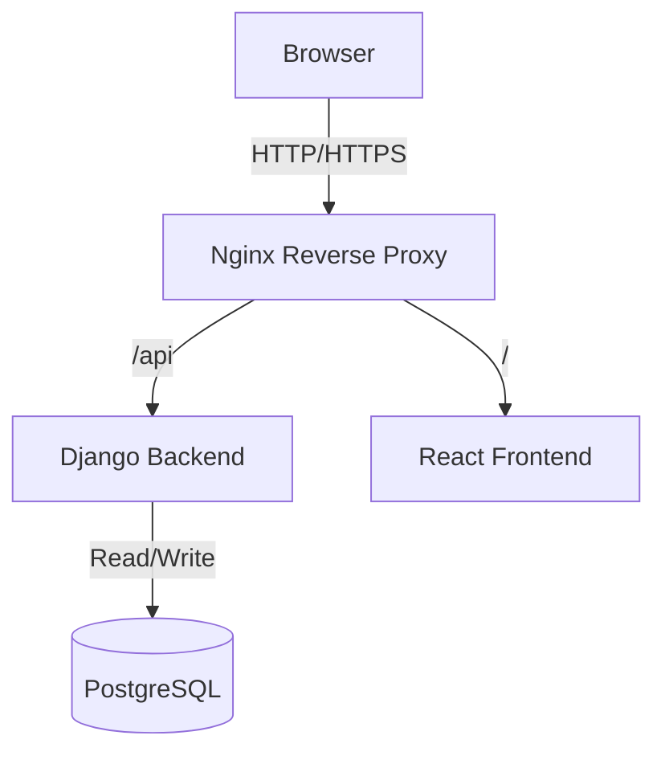
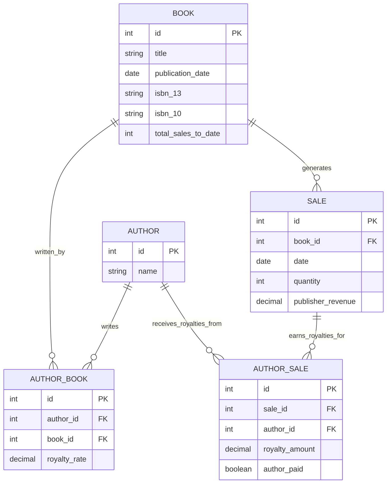

# Developer Guide

## 1. High-Level System Construction

- **Frontend**: We built the frontend using React. It handles the user interface and interacts with the backend via a REST API. It is served using Vite for development and built for production.
- **Backend**: A Django application using the Django REST Framework (DRF) to provide API endpoints. It manages data validation, business logic, database interactions, and authentication.
- **Database**: PostgreSQL is used as the relational database.
- **Infrastructure**: The application is containerized using Docker and Docker Compose. Nginx is used as a reverse proxy in production to serve static files and proxy API requests.

### Architecture Outline (Conceptual)



## 2. Technologies Used

### Frontend

- **Framework**: React 19
- **Build Tool**: Vite
- **Styling**: Tailwind CSS 4
- **Routing**: React Router 7
- **State/UI Libraries**: React Select, React Datepicker
- **Linting**: ESLint

### Backend

- **Framework**: Django 5.2
- **API Framework**: Django REST Framework (DRF)
- **Language**: Python 3
- **Database Interface**: psycopg2-binary
- **Server**: Gunicorn (Production), Django Development Server (Local)
- **Static Files**: WhiteNoise
- **Testing**: pytest, pytest-django

### Infrastructure & Tools

- **Containerization**: Docker, Docker Compose
- **Production Server**: Nginx
- **Database**: PostgreSQL

## 3. Development Environment Setup

We use Docker Compose to create a consistent development environment.

### Prerequisites

- **Docker Desktop** (or Docker Engine + Compose)
- **Git**

### Quick Start (Local Development)

1.  **Configure Environment**:
    Create a `.env` file in the root directory (see `README.md` for template).

2.  **Start the Application**:
    Use the helper script to start the development environment:

    ```bash
    ./dev.sh
    ```

    This script runs `docker-compose -f docker-compose.dev.yml up --build`.

3.  **Access the App**:
    - Frontend: `http://localhost`
    - Backend Admin: `http://localhost:8000/admin/`

### Common Commands

- **Run Backend Tests**:
  ```bash
  docker compose -f docker-compose.dev.yml exec backend pytest
  ```
- **Make Migrations**:
  ```bash
  docker compose -f docker-compose.dev.yml exec backend python manage.py makemigrations
  ```
- **Apply Migrations**:
  ```bash
  docker compose -f docker-compose.dev.yml exec backend python manage.py migrate
  ```
- **Create Superuser**:
  ```bash
  docker compose -f docker-compose.dev.yml exec backend python manage.py createsuperuser
  ```

For detailed setup and deployment instructions, please examine the `README.md` file in the project root.

## 4. Database Schema

The core data model revolves around Books, Authors, and Sales. The schema is defined in `src/django-backend/bookapp/models.py`.

### Entity Relationship Diagram (ERD)



### Table Details

1.  **Author**
    - Represents a book author.
    - `name`: Unique name of the author.

2.  **Book**
    - Represents a published book.
    - `title`: Title of the book.
    - `publication_date`: Date the book was published.
    - `isbn_13`: 13-digit ISBN (Unique, Validated).
    - `isbn_10`: 10-digit ISBN (Optional, Validated).
    - `total_sales_to_date`: Cached field tracking total quantity sold (updated via `update_total_sales` method).

3.  **AuthorBook** (Join Table)
    - Links `Author` and `Book` (Many-to-Many).
    - `royalty_rate`: The specific royalty rate for _this_ author on _this_ book.
    - Validates that `royalty_rate` is between 0 and 1.

4.  **Sale**
    - Represents a sales transaction for a specific book.
    - `quantity`: Number of books sold.
    - `publisher_revenue`: Total revenue for the publisher from this sale.
    - `date`: Date of the sale.
    - **Logic**: When a sale is created, it triggers the creation of `AuthorSale` records for all authors associated with the book.

5.  **AuthorSale** (Join Table)
    - Links `Sale` and `Author` (Many-to-Many).
    - `royalty_amount`: The calculated royalty amount for the author for this specific sale.
    - `author_paid`: Boolean flag indicating if the author has been paid for this sale.

### Key Logic Flow

- When a `Sale` is recorded, the system calculates royalties based on the `AuthorBook.royalty_rate` and `Sale.publisher_revenue`.
- These calculations are stored in `AuthorSale` records.
- `Book.total_sales_to_date` is updated to reflect the new `Sale.quantity`.

## 5. Production Deployment

The application is deployed to a Duke VM using Docker Compose and Nginx with SSL (Let's Encrypt).

### Prerequisites

- **Access**: SSH access to the target VM.
- **Docker Hub**: Account to push images (configured in `deploy.sh`).
- **VM Setup**: Docker and Docker Compose must be installed on the VM.

### Deployment Process

We use the `deploy.sh` script to automate the pipeline. This script:

1.  **Builds** the Docker images (specifically for `linux/amd64` architecture).
2.  **Pushes** the images to Docker Hub.
3.  **Copies** configuration files (`docker-compose.yml`, `.env`) to the VM via SCP.
4.  **Restarts** the application on the VM.

### Routine Deployment

To deploy the latest code from your local machine:

1.  Ensure you are logged into Docker Hub: `docker login`
2.  Run the deployment script:
    ```bash
    ./deploy.sh
    ```

### Production Database Management

To perform administrative tasks on the production database, you must SSH into the VM and execute commands inside the running container.

**Example: Running Migrations**

```bash
# 1. SSH into the VM
ssh <your-netid>@<vm-host>

# 2. Run migrate command inside the backend container
# Note: The container name usually tracks the folder name, e.g., 'book-publishing-app-backend-1'
# Use 'docker ps' to confirm the exact name.
docker exec -it book-app-deployment-backend-1 python manage.py migrate
```

**Example: creating a Superuser**

```bash
docker exec -it book-app-deployment-backend-1 python manage.py createsuperuser
```

For information on the one-time SSL setup using `init-letsencrypt.sh`, refer to the `README.md`.
